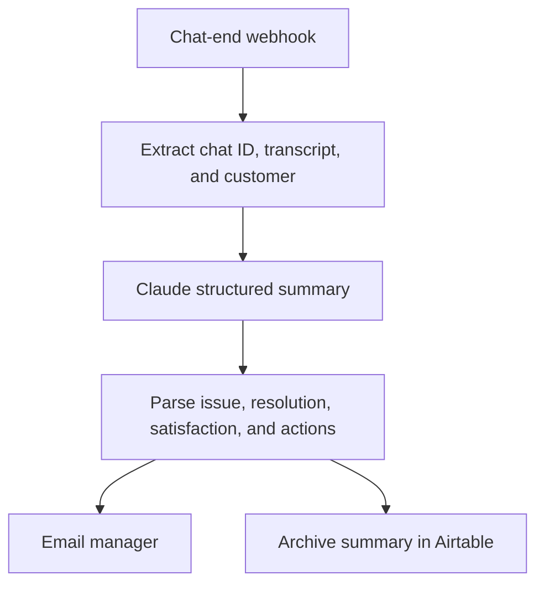

# Support Chat Transcript Summarizer

Turns a raw support chat transcript into a structured summary for managers and a searchable knowledge base entry.

 -333?style=flat-square)  


---

**[Open the visual project page →](./index.html)**

## Table of Contents

- [Overview](#overview)
- [Architecture](#architecture)
- [Workflow](#workflow)
- [Tech Stack](#tech-stack)
- [Demo status](#demo-status)
- [Setup](#setup)
- [Repository Structure](#repository-structure)
- [Disclaimer](#disclaimer)

## Overview

**Trigger:** Webhook (chat transcript: chat_id, transcript, customer_name)

Turns a raw support chat transcript into a structured summary for managers and a searchable knowledge base entry.

### Key Features

- Structured issue/resolution/satisfaction extraction
- Manager-facing HTML email summary
- Searchable knowledge-base archive

## Architecture

The diagram below represents the sanitized template flow. External services, credentials, and environment-specific identifiers must be configured before execution.



## Workflow

1. Chat-end webhook receives the full transcript
2. Extract chat ID, transcript text, and customer name
3. Claude summarizes issue, resolution, satisfaction score, and action items
4. Parse the structured fields out of the model's response
5. Email the manager a formatted summary and archive it to Airtable

## Tech Stack

- n8n
- Claude (Anthropic API)
- SendGrid
- Airtable

## Demo status

A configured live-run recording is not included yet. Credentials and service identifiers remain placeholders.


## Setup

1. Import `workflow/T14_Chat_Transcript_Summary.json` into your n8n instance (**Workflows → Import from File**).
2. Replace every placeholder credential/URL in the workflow (e.g. `YOUR_..._API_KEY`, `YOUR_..._URL`) with your own service credentials.
3. Activate the workflow and point the relevant integration (webhook source, scheduled trigger, etc.) at the generated webhook URL.
4. Test with a sample payload before going live.

## Repository Structure

```text
.
├── index.html
├── README.md
├── LICENSE
├── .gitignore
└── workflow/
    └── T14_Chat_Transcript_Summary.json
```


## Disclaimer

This workflow was built as a portfolio/template project to demonstrate n8n workflow automation and AI integration. API credentials and sensitive configuration have been removed before publication — replace all `YOUR_..._KEY` / `YOUR_..._URL` placeholders with your own before use.

---

Designed and engineered by

**Oyekola Ololade**

AI Systems & Integration Engineer

- LinkedIn: <http://linkedin.com/in/ololade-oyekola-5b1797397>
- Email: <oyekolaololade69@gmail.com>
